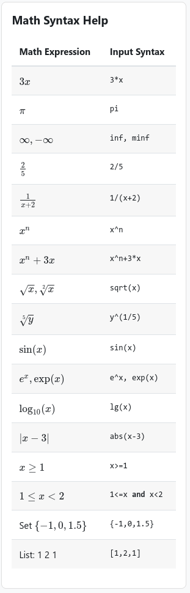
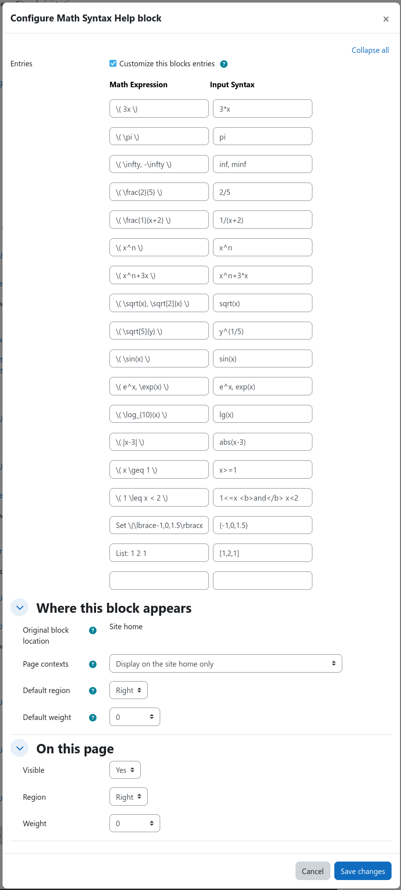
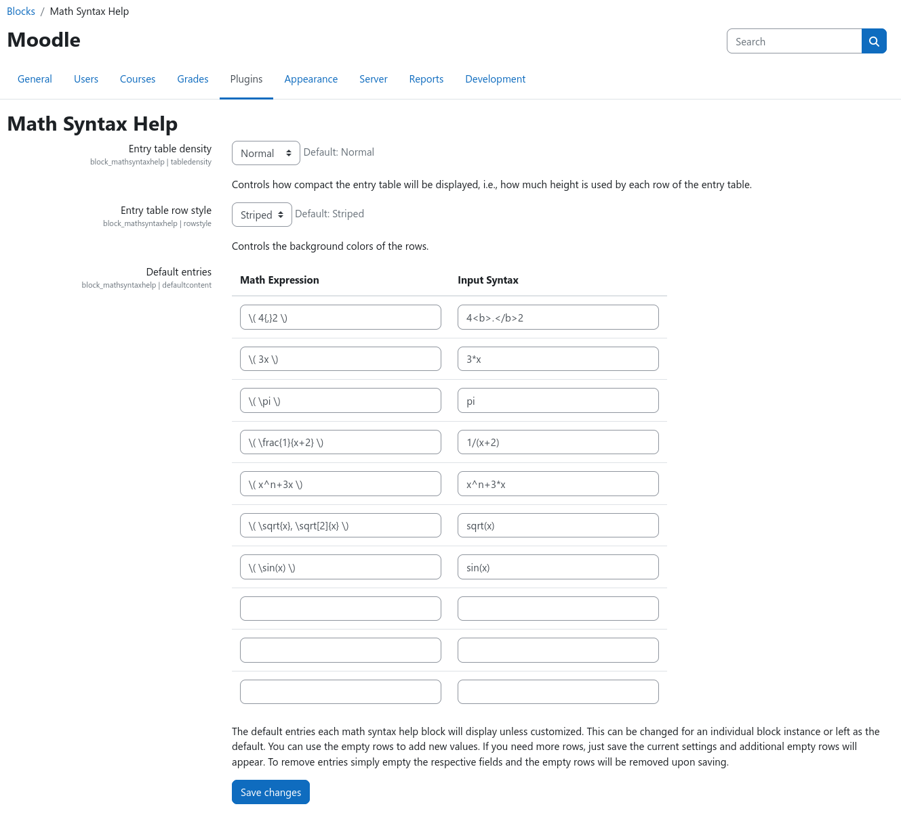

# Math Syntax Help Block

[](https://github.com/ngandrass/moodle-block_mathsyntaxhelp/releases)
[%7D&replace=%24%3Cdata%3E&label=PHP&color=blue)](https://github.com/ngandrass/moodle-block_mathsyntaxhelp/blob/master/version.php)
[%7D&replace=%24%3Cdata%3E&label=Moodle&color=orange)](https://github.com/ngandrass/moodle-block_mathsyntaxhelp/blob/master/version.php)
[](https://github.com/ngandrass/moodle-block_mathsyntaxhelp/actions/workflows/moodle-plugin-ci.yml)
[](https://coveralls.io/github/ngandrass/moodle-block_mathsyntaxhelp)
[](https://github.com/ngandrass/moodle-block_mathsyntaxhelp/issues)
[](https://github.com/ngandrass/moodle-block_mathsyntaxhelp/pulls)
[](https://github.com/ngandrass/moodle-block_mathsyntaxhelp/)
[](https://github.com/ngandrass/moodle-block_mathsyntaxhelp/blob/master/LICENSE)
[](https://www.paypal.me/ngandrass)
[](https://github.com/sponsors/ngandrass)
[](https://github.com/ngandrass/moodle-block_mathsyntaxhelp/stargazers)
[](https://github.com/ngandrass/moodle-block_mathsyntaxhelp/network/members)
[](https://github.com/ngandrass/moodle-block_mathsyntaxhelp/graphs/contributors)

A Moodle block that displays a configurable list of common math input syntax examples alongside their rendered MathJax
equivalents. This block serves as a quick reference guide for users when entering mathematical expressions in Moodle,
especially in conjunction with [STACK](https://stack-assessment.org/).

The math syntax help block is available via the [Moodle plugin directory](https://moodle.org/plugins/block_mathsyntaxhelp):

[](https://moodle.org/plugins/block_mathsyntaxhelp)


## Features

- Display rendered math expressions alongside their input syntax
- Configurable list of common math syntax examples
- Use of global site-wide default entries or custom entries for single block instances
- Customizable display density and entry background colors
- Usable in any Moodle block area (e.g., in quizzes, courses, ...)
- Control of block instance customization via Moodle capabilities


## Configuration and Usage

After installation, the block will be populated with a default set of math syntax help entries. These default entries
can be customized via the site administration at _Site administration > Plugins > Blocks > Math Syntax Help Block_ (see
[admin block settings](#admin-block-settings)).

By default, all freshly created block instance will use the configured default entries. If a user has the capability
`block/mathsyntaxhelp:customize`, they can customize the entries of any specific block instance via the block instance
settings (see [block instance customization](#block-instance-customization)). If no custom entries are defined for a
block instance, the global default entries will always be used and will automatically be updated on any change via the
block admin settings page.

If you wish to customize the way the math syntax help entries are displayed, you can adjust the table density, i.e.,
row height, and the background color of the entries via the block admin settings page.


## Installation

This plugin can be installed like any other Moodle plugin by placing its source code inside your Moodle installation and
executing the upgrade routine afterward.


### Installing via the site administration (uploaded ZIP file)

1. Download the latest release of this plugin from the [Moodle plugin directory](https://moodle.org/plugins/block_mathsyntaxhelp).
2. Log in to your Moodle site as an admin and go to _Site administration > Plugins > Install plugins_.
3. Upload the ZIP file with the plugin code.
4. Check the plugin validation report and finish the installation.


### Installing manually

The plugin can be also installed by putting the contents of this directory into

```
{your/moodle/dirroot}/blocks/mathsyntaxhelp
```

Afterwards, log in to your Moodle site as an admin and go to _Site administration > Notifications_ to complete the
installation.

Alternatively, you can run `php admin/cli/upgrade.php` from the command line to complete the installation.


## Reporting a bug or requesting a feature

If you find a bug or have a feature request, please open an issue via the [GitHub issue tracker](https://github.com/ngandrass/moodle-block_mathsyntaxhelp/issues).

Please do not use the comments section within the Moodle plugin directory. Thanks :)


## Screenshots

### Example block



### Block instance customization



### Admin block settings




## License

2025 Niels Gandraß <niels@gandrass.de>

This program is free software: you can redistribute it and/or modify it under
the terms of the GNU General Public License as published by the Free Software
Foundation, either version 3 of the License, or (at your option) any later
version.

This program is distributed in the hope that it will be useful, but WITHOUT ANY
WARRANTY; without even the implied warranty of MERCHANTABILITY or FITNESS FOR A
PARTICULAR PURPOSE.  See the GNU General Public License for more details.

You should have received a copy of the GNU General Public License along with
this program.  If not, see <https://www.gnu.org/licenses/>.